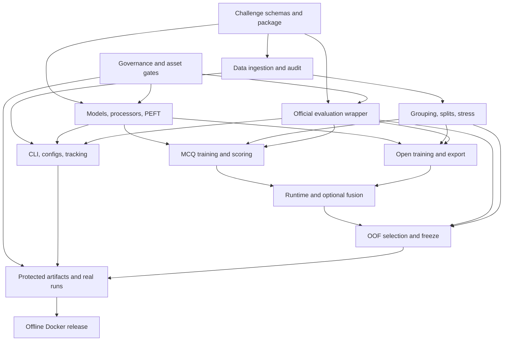

# MedReason 2026 execution index

## Authority and purpose

`local://medreason-gemma-win-plan.md` is the authoritative strategy. This folder decomposes that strategy into small implementation and operations cards. A card may clarify repository mechanics, tests, artifacts, and dependencies; it may not weaken a stop gate or add an unapproved training source, judge substitute, model route, or lockbox decision.

The target is a reproducible, winning-caliber post-challenge result. An official 2026 submission is prohibited unless the organizers provide a written exception. Local GT/VA scores remain proxies even when the exact planned judge checkpoints run.

## Current prerequisite evidence

Measured on 2026-08-09 in this checkout:

| Requirement | Observed | Consequence |
|---|---:|---|
| Training/evaluation GPU | RTX 3090, 24,576 MiB | Fixture and small-model work is actionable. Gemma 4 31B/26B, 70B/72B judge, and 48/96 GB profile claims are blocked. |
| Free repository filesystem capacity | 364 GiB | Below the plan's 600 GiB reserve. Full immutable snapshots, wheelhouse, caches, and checkpoint rotation are blocked. |
| Configured remote compute | No SSH hosts | No alternate 48/96 GB execution target is currently available through this harness. |
| Synapse access and archive hashes | Not evidenced in the checkout | Real data audit and every downstream experiment remain blocked until GOV-02 and OPS-02/03 produce evidence. |
| Organizer exception | Not evidenced | OPS-01 is a hard gate for any official-submission claim, not for post-challenge research. |
| Gated model/judge acceptance | Not evidenced | A human license owner must complete acceptance; code must fail closed. |

Agents must not turn an external blocker into a mock result. They may complete fixture-backed implementation and tests while leaving the protected acceptance tier explicitly blocked.

## Task files

| File | Stable task range | Scope |
|---|---|---|
| `01_governance_and_assets.md` | GOV-01…GOV-10 | Eligibility, licenses, immutable revisions, provenance, preflight |
| `02_schemas_and_package.md` | SCH-01…SCH-09 | Isolated package, normalized/runtime/artifact contracts |
| `03_data_ingestion_and_audit.md` | DAT-01…DAT-12 | Secure loading, image audit, hashes, audit CLI |
| `04_grouping_splits_and_stress.md` | SPL-01…SPL-10, STR-01…STR-06 | Leakage groups, splits, bias diagnostics, OOD proxies |
| `05_models_processors_and_peft.md` | MOD-01…MOD-14 | Native multimodal loading, registry, QLoRA, adapters, memory |
| `06_evaluation_and_judges.md` | EVA-01…EVA-15 | Official parity, proxy judges, controls, tournament |
| `07_mcq_training_and_scoring.md` | MCQ-01…MCQ-15 | Permutation SFT, conditional scoring, optional gates |
| `08_open_training_and_export.md` | OPEN-01…OPEN-15 | Evidence/answer SFT, structured export, optional gates |
| `09_runtime_fusion_and_fallback.md` | RUN-01…RUN-15 | Adapter routing, fallbacks, optional fusion/views/retrieval |
| `10_selection_oof_and_freeze.md` | SEL-01…SEL-16 | Corrected paired tests, OOF fitting, freeze, lockbox |
| `11_cli_configs_and_tracking.md` | CLI-01…CLI-10 | Stable commands, recipes, validation, metadata |
| `12_docker_offline_release.md` | DOC-01…DOC-16 | Offline image, official fixture, deterministic release |
| `13_experiment_execution.md` | OPS-01…OPS-18 | Access, real runs, gates, freeze, deployment, export |

The todo tracker uses every card title verbatim. IDs are permanent; do not renumber them after another task references them.

## Dependency graph

An arrow means the downstream task consumes a stable contract or artifact, not that every task in the upstream file must finish first. Each card lists its exact dependencies.

## Parallel execution waves

### Wave A — roots and immutable contracts

Run concurrently with exclusive file ownership:

- Governance evidence collection and registry design: GOV-01…GOV-09.
- Package/schema contracts: SCH-01…SCH-09.
- Official-source vendoring design: EVA-01 and DOC-01/DOC-08/DOC-09.
- CLI/config shape design that does not import models: CLI-01/CLI-02/CLI-08/CLI-10.

GOV tasks involving license acceptance or organizer/Synapse approval require a human owner. Agents collect evidence and implement fail-closed checks; they do not click acceptance or claim approval.

### Wave B — fixture-backed core implementation

After the relevant SCH contracts freeze, run the following workstreams concurrently:

- DAT-01…DAT-12, then SPL/STR tasks as their audit fields become stable.
- MOD loader/processor/registry/adapter tasks using tiny local fakes; protected checkpoint smokes stay gated.
- EVA official aggregation/parity, artifacts, and control plumbing using official toy fixtures.
- DOC context, manifest, entrypoint, validator, and smoke plumbing without embedding real weights.

No worker may create a second challenge schema in a shared package to avoid a dependency. Update the single schema owner or wait.

### Wave C — task routes and stable commands

After data, model, and evaluation interfaces stabilize:

- MCQ-01…MCQ-12 and OPEN-01…OPEN-10 may run in parallel because adapters and targets are separate.
- RUN-01…RUN-08 may run against fake adapters while training implementation proceeds.
- CLI recipe/config tasks may run concurrently once their builder interfaces are named.
- Optional MCQ, open, views, specialist, fusion, and retrieval tasks implement candidates only; promotion awaits paired evidence.

### Wave D — selection machinery

SEL-01…SEL-12 can be implemented and tested on synthetic grouped predictions while protected models/data remain unavailable. SEL-13…SEL-16 require real frozen artifacts and therefore wait for the operations gates.

### Wave E — protected experiments

OPS cards are intentionally serialized where evidence flows forward:

1. Eligibility, access, exact artifacts, storage, and hardware.
2. Strict data audit/split and frozen evaluator/judges.
3. Zero-shot tournament and advancement decision.
4. MCQ/open SFT.
5. One-at-a-time optional component tests.
6. Three-fold OOF fitting and exactly one system selection.
7. Development-pool research freeze.
8. Exactly one lockbox evaluation.
9. Distinct all-label deployment training.
10. Offline Docker validation and export.

Do not parallelize candidates that must share a frozen decision artifact by letting each candidate rewrite that artifact. Run candidate inference concurrently if resources permit, then let one selection owner write the decision.

## Agent execution protocol

1. Claim exactly one task ID and read its complete card, dependencies, and handoff.
2. Read only the target code sections and existing test patterns named by the card. Reuse existing conventions; do not introduce a parallel framework.
3. Before changing an exported symbol, use LSP references. Use LSP rename/code actions for symbol-aware refactors.
4. Own only the card's exclusive files. If a shared contract must change, message its owner before editing.
5. Implement the source fix. Do not suppress failures, fabricate model outputs, add pseudo-labels, or silently downgrade an unavailable judge/model.
6. Add only contract-level tests named by the card. Unit tests use deterministic fakes and synthetic images; protected tests remain opt-in.
7. Run the focused test command, then the smallest smoke scenario that exercises the changed path. Project-wide validation runs once after a merge wave, not in every worker.
8. Return changed paths, observed command output, artifact hashes, unresolved external blockers, and the exact downstream handoff. Never report a protected tier as passed from fixture evidence.

## Verification tiers

| Tier | Evidence | Permitted claim |
|---|---|---|
| Contract | Focused CPU tests with synthetic fixtures | Schema, algorithm, privacy, and error-policy correctness |
| Synthetic GPU | Tiny local multimodal fake/checkpoint under the protected marker | Tensor routing, masking, batching, adapter switching |
| Real checkpoint | Exact immutable revision with access and `MEDFM_RUN_REAL_CHECKPOINTS=1` | Loader/processor compatibility for that checkpoint only |
| Hardware profile | Full worst-case scenario on matching 48 or 96 GB hardware | That profile's measured VRAM/latency compatibility |
| Research evaluation | Frozen 85% artifact opened on lockbox exactly once | Lockbox point estimate/interval for that artifact only |
| Deployment | All-label retrain plus offline container validation | Reproducible deployment artifact; never inherit lockbox score |

## Global stop conditions

Stop the affected branch, preserve evidence, and continue only independent work when any of these occurs:

- Exact data/model/judge artifact or governing terms cannot be verified.
- A released-data archive has a mismatched hash, duplicate ID, bad/missing image, invalid options, missing train answer, or participant-validation answer.
- A processor output is truncated or a multimodal tensor field is dropped.
- The 100-real-batch memory gate exceeds `min(85 GiB, 0.90 × total device memory)`.
- An exact proxy judge is unavailable; GT/VA promotion and winning-caliber claims stop.
- An optional component misses its corrected paired promotion/non-inferiority/grounding gate; delete it from the selected route.
- Any candidate, calibration fit, threshold fit, or retraining reads participant validation or lockbox outside the one frozen evaluation.
- Offline resolution tries the Hub/network, logs sensitive input/reference content or paths, produces invalid/missing IDs, or is nondeterministic.

## Official immutable anchors

- Source repository: <https://github.com/medreason26/MedReason-Challenge-Docker/tree/05748c0341b72dc08132bd108208b78dc14a2f0b>
- Official runtime reads `/input/cases.json` and writes `/output/results.json`.
- Official result schema version: `{ "major": 1, "minor": 0 }`.
- Public MCQ scoring is exact label match.
- Public VA cap: `RVF_trace <= 1` caps `VA_answer` at 1; `RVF_trace == 2` caps it at 3; otherwise VA is unchanged.

Every vendored official file needs its source URL, commit, byte count, and SHA-256 in a committed manifest. Changes belong in wrappers, never in an unmarked fork presented as the official file.
